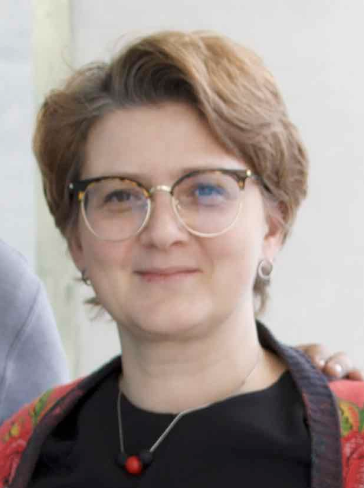
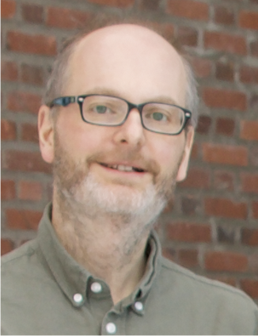
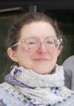
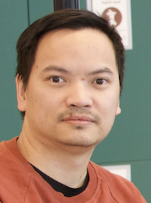
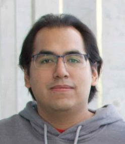
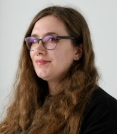

------
## Project leader

  [Elena Volodina](https://spraakbanken.gu.se/en/about/staff/elena),  [Språkbanken](https://spraakbanken.gu.se/en), University of Gothenburg, Sweden 

--------

## Core team

  [Simon Dobnik](https://www.gu.se/en/about/find-staff/simondobnik), [CLASP](https://gu-clasp.github.io/), University of Gothenburg, Sweden 

 [Therese Lindström Tiedemann](https://researchportal.helsinki.fi/en/persons/therese-lindstr%C3%B6m-tiedemann),  [University of Helsinki](https://researchportal.helsinki.fi/en/), Finland 

  [Xuan-Son Vu](https://people.cs.umu.se/sonvx/),  [Umeå University](https://www.umu.se/institutionen-for-datavetenskap/), Sweden

--------

## PhD students

  [Ricardo Muñoz Sánchez](https://rimusa.github.io/), [Språkbanken](https://spraakbanken.gu.se/en), University of Gothenburg, Sweden 

  [Maria Irena Szawerna](), [Språkbanken](https://spraakbanken.gu.se/en), University of Gothenburg, Sweden 

--------

## Participating organizations

     

--------

## Contact

* Email: mormor.karl at svenska.gu.se
* Post: Språkbanken Text, SFS department, University of Gothenburg, Box 200, 405 30 Gothenburg
* Visiting address: Renströmsgatan 6, Gothenburg (Humanisten)

--------

**Past collaborators**

| Picture4 | Name4 | Place4 |

| Picture5 | Name5 | Place5 |

