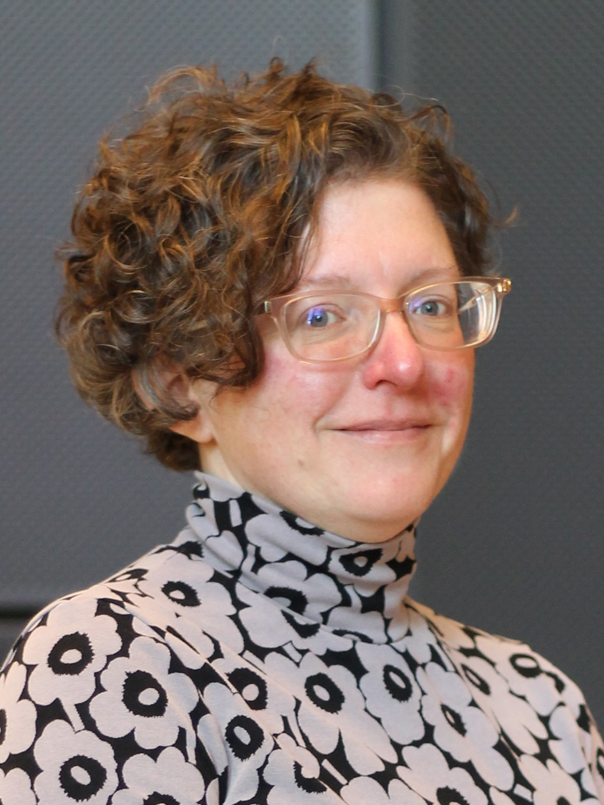
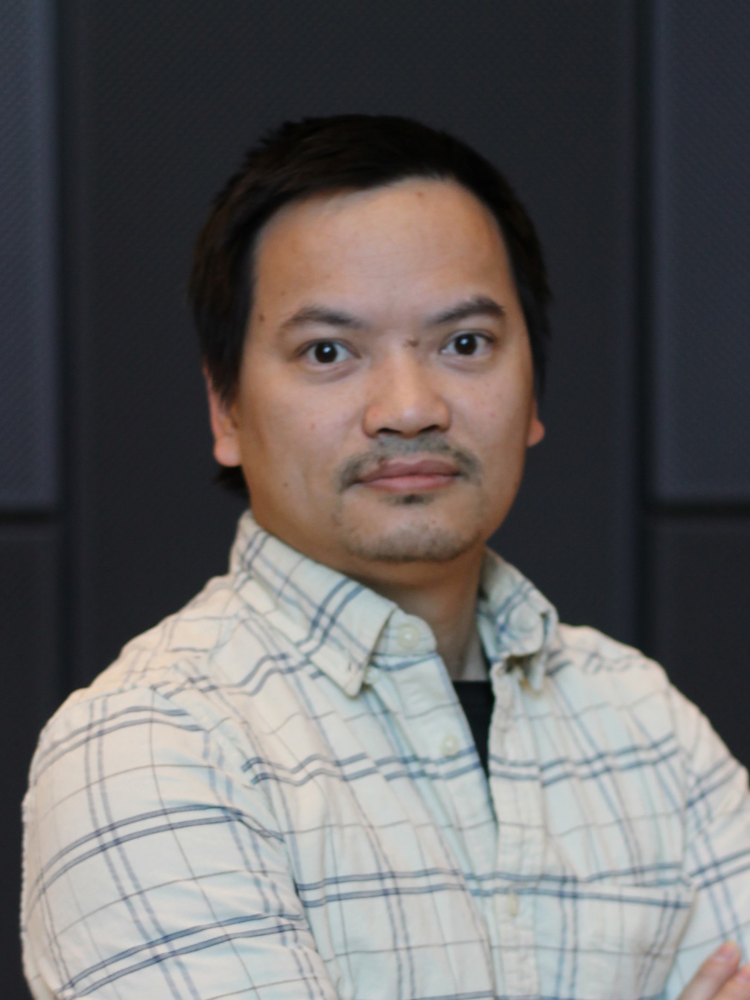
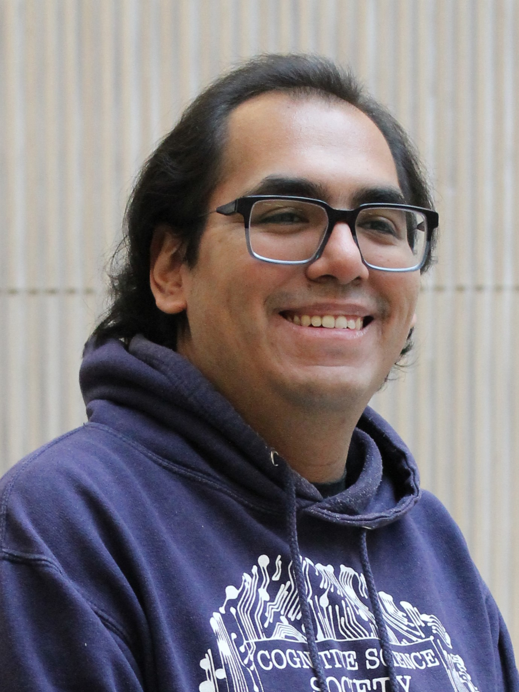

------
## Project leader

|  | [Elena Volodina](https://spraakbanken.gu.se/en/about/staff/elena)    [Språkbanken](https://spraakbanken.gu.se/en), University of Gothenburg, Sweden   Digital language resources, L2 infrastructure, NLP, ICALL|

--------

## Core team

|  | [Simon Dobnik](https://www.gu.se/en/about/find-staff/simondobnik)  [CLASP](https://gu-clasp.github.io/), University of Gothenburg, Sweden   NLP, Computational modeling, Machine learning |
|  | [Therese Lindström Tiedemann](https://researchportal.helsinki.fi/en/persons/therese-lindstr%C3%B6m-tiedemann)    [University of Helsinki](https://researchportal.helsinki.fi/en/), Finland   Scandinavian languages, Applied linguistics, Second language acquisition, Learner corpus research|
|  | [Xuan-Son Vu](https://people.cs.umu.se/sonvx/)    [Lund University](https://portal.research.lu.se/sv/organisations/department-of-computer-science), Sweden   Data Science, Computational privacy techniques|

--------

## PhD students

|  | [Ricardo Muñoz Sánchez](https://rimusa.github.io/)   [Språkbanken](https://spraakbanken.gu.se/en), University of Gothenburg, Sweden   NLP, biases in learner datasets and models|
|  | [Maria Irena Szawerna](https://sites.google.com/view/mariaszawerna/home)   [Språkbanken](https://spraakbanken.gu.se/en), University of Gothenburg, Sweden   NLP, automatic methods for pseudonymization |
|  | [Lisa Södergård](https://www.helsinki.fi/en/about-us/people/people-finder/lisa-soderg%C3%A5rd-9119204)   [University of Helsinki](https://researchportal.helsinki.fi/en/), Finland   Scandinavian languages, effects of pseudonymization on research data |

--------

## Other contributors

| [Nikolai Ilinykh](https://gu-clasp.github.io/people/nikolai-ilinykh/) |  |  |

--------

## Participating organizations

  

  

--------

## Contact

* Email: [mormor.karl@svenska.gu.se](mailto:mormor.karl@svenska.gu.se)
* Post: Språkbanken Text, SFS department, University of Gothenburg, Box 200, 405 30 Gothenburg
* Visiting address: Renströmsgatan 6, Gothenburg (Humanisten)

--------

<!-- **Past collaborators**

| Picture4 | Name4 | Place4 |

| Picture5 | Name5 | Place5 | -->

